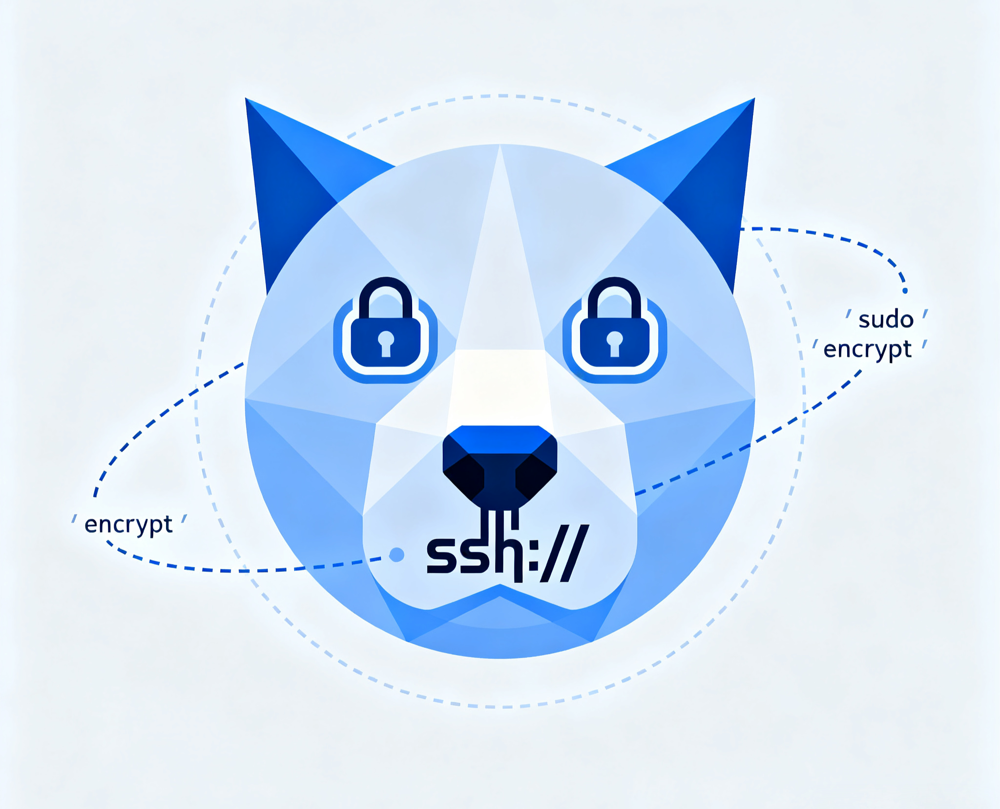

<div align="center">
  
</div>

---

DogSSH is a terminal-based, interactive SSH manager inspired by tools like lazydocker and k9s — but built for managing your fleet of servers directly from your terminal.
<br/>
With dogssh, you can quickly navigate, connect, manage, and transfer files between your local machine and any server defined in your `~/.ssh/config`. No more remembering IP addresses or running long scp commands — just a clean, keyboard-driven UI.

---

## ✨ Features

### Server Management
- 📜 Read & display servers from your `~/.ssh/config` in a scrollable list.
- ➕ Add a new server from the UI by specifying alias, host/IP, username, port, identity file.
- ✏ Edit existing server entries directly from the UI.
- 🗑 Delete server entries safely.
- 📌 Pin / unpin servers to keep favorites at the top.
- 🏓 Ping server to check status.

### Quick Server Navigation
- 🔍 Fuzzy search by alias, IP, or tags.
- 🖥 One‑keypress SSH into the selected server (Enter).
- 🏷 Tag servers (e.g., prod, dev, test) for quick filtering.
- ↕️ Sort by alias or last SSH (toggle + reverse).


### Upcoming
- 📁 Copy files between local and servers with an easy picker UI.
- 📡 Port forwarding (local↔remote) from the UI.
- 🔑 Enhanced Key Management:
    - Use default local public key (`~/.ssh/id_ed25519.pub` or `~/.ssh/id_rsa.pub`)
    - Paste custom public keys manually
    - Generate new keypairs and deploy them
    - Automatically append keys to `~/.ssh/authorized_keys` with correct permissions
---

## 🔐 Security Notice

dogssh does not introduce any new security risks.
It is simply a UI/TUI wrapper around your existing `~/.ssh/config` file.

- All SSH connections are executed through your system’s native ssh binary (OpenSSH).

- Private keys, passwords, and credentials are never stored, transmitted, or modified by dogssh.

- Your existing IdentityFile paths and ssh-agent integrations work exactly as before.

- dogssh only reads and updates your `~/.ssh/config`. A backup of the file is created automatically before any changes.

- File permissions on your SSH config are preserved to ensure security.


## 🛡️ Config Safety: Non‑destructive writes and backups

- Non‑destructive edits: dogssh only writes the minimal required changes to your ~/.ssh/config. It uses a parser that preserves existing comments, spacing, order, and any settings it didn’t touch. Your handcrafted comments and formatting remain intact.
- Atomic writes: updates are written to a temporary file and then atomically renamed over the original, minimizing the risk of partial writes.
- Backups:
  - One‑time original backup: before dogssh makes its first change, it creates a single snapshot named config.original.backup beside your SSH config. If this file is present, it will never be recreated or overwritten.
  - Rolling backups: on every subsequent save, dogssh also creates a timestamped backup named like: ~/.ssh/config-<timestamp>-dogssh.backup. The app keeps at most 10 of these backups, automatically removing the oldest ones.

## 📷 Screenshots

<div align="center">

### 🚀 Startup


Clean loading screen when launching the app

---

### 📋 Server Management Dashboard


Main dashboard displaying all configured servers with status indicators, pinned favorites at the top, and easy navigation

---

### 🔎 Search


Fuzzy search functionality to quickly find servers by name, IP address, or tags

---

### ➕ Add Server


User-friendly form interface for adding new SSH connections.

---

### 🔐 Connect to server


SSH into the selected server

</div>

---

## 📦 Installation

### Option 1: Homebrew (macOS)

```bash
brew install Adembc/homebrew-tap/dogssh
```

### Option 2: Download Binary from Releases

Download from [GitHub Releases](https://github.com/Adembc/dogssh/releases). You can use the snippet below to automatically fetch the latest version for your OS/ARCH (Darwin/Linux and amd64/arm64 supported):

```bash
# Detect latest version
LATEST_TAG=$(curl -fsSL https://api.github.com/repos/Adembc/dogssh/releases/latest | jq -r .tag_name)
# Download the correct binary for your system
curl -LJO "https://github.com/Adembc/dogssh/releases/download/${LATEST_TAG}/dogssh_$(uname)_$(uname -m).tar.gz"
# Extract the binary
tar -xzf dogssh_$(uname)_$(uname -m).tar.gz
# Move to /usr/local/bin or another directory in your PATH
sudo mv dogssh /usr/local/bin/
# enjoy!
dogssh
```

### Option 3: Build from Source

```bash
# Clone the repository
git clone https://github.com/Adembc/dogssh.git
cd dogssh

# Build for macOS
make build
./bin/dogssh

# Or Run it directly
make run
```

---

## ⌨️ Key Bindings

| Key   | Action                        |
| ----- | ----------------------------- |
| /     | Toggle search bar             |
| ↑↓/jk | Navigate servers              |
| Enter | SSH into selected server      |
| c     | Copy SSH command to clipboard |
| g     | Ping selected server          |
| r     | Refresh background data       |
| a     | Add server                    |
| e     | Edit server                   |
| t     | Edit tags                     |
| d     | Delete server                 |
| p     | Pin/Unpin server              |
| s     | Toggle sort field             |
| S     | Reverse sort order            |
| q     | Quit                          |

Tip: The hint bar at the top of the list shows the most useful shortcuts.

---

## 🤝 Contributing

Contributions are welcome!

- If you spot a bug or have a feature request, please [open an issue](https://github.com/adembc/dogssh/issues).
- If you'd like to contribute, fork the repo and submit a pull request ❤️.

We love seeing the community make DogSSH better 🚀

---

## ⭐ Support

If you find DogSSH useful, please consider giving the repo a **star** ⭐️ and join [stargazers](https://github.com/adembc/dogssh/stargazers).

☕ You can also support me by [buying me a coffee](https://www.buymeacoffee.com/adembc) ❤️
<br/>
<a href="https://buymeacoffee.com/adembc" target="_blank"></a>


---

## 🙏 Acknowledgments

- Built with [tview](https://github.com/rivo/tview) and [tcell](https://github.com/gdamore/tcell).
- Inspired by [k9s](https://github.com/derailed/k9s) and [lazydocker](https://github.com/jesseduffield/lazydocker).

